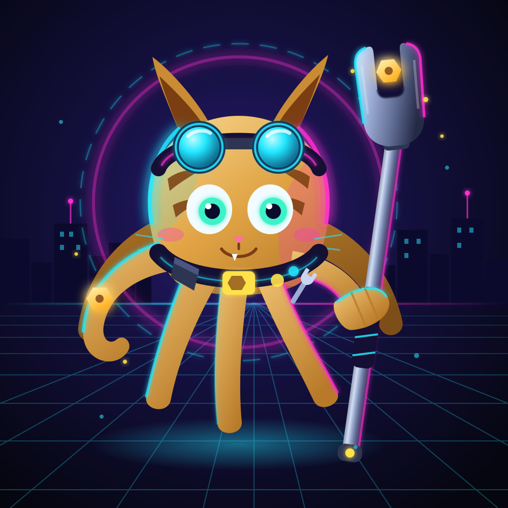
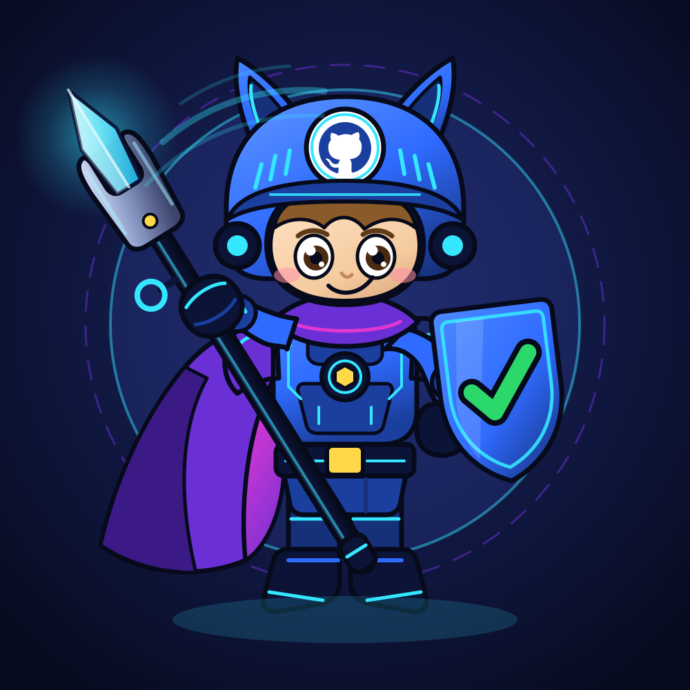

# Tinkerer Octocat

An entry for the **GitHub Octocat Drawing Contest**: an armored GitHub knight,
hand-authored as flat-vector SVG.

The character is a chibi paladin in royal blue plate with cyan circuit-line
etching, a purple cape with a magenta lining, and a cat-eared helm crowned by
the GitHub mark. The right hand carries a wrench-spear — an open-end wrench jaw
with a glowing crystal blade seated in it — and the left arm braces a heater
shield bearing a green CI-passing checkmark.

<p align="center">
  
  
  
</p>

> GitHub sanitizes SVG in Markdown and strips animation, so the middle preview
> renders as a still frame here. Open
> [`ratchet-tinkerer-animated.svg`](ratchet-tinkerer-animated.svg) directly in a
> browser to see it move.

## The three artworks

| File | What it is |
| --- | --- |
| [`ratchet-tinkerer-neon-cyberpunk.svg`](ratchet-tinkerer-neon-cyberpunk.svg) | The static master. Upright confident stance, staff planted, shield forward. Every other variant is derived from this one. |
| [`ratchet-tinkerer-animated.svg`](ratchet-tinkerer-animated.svg) | The same artwork with a gentle looping idle: the figure breathes, the cape sways from the shoulder pin, the helm ears tilt, and the crystal tip pulses. Pure SMIL, so it animates standalone in a browser with no CSS or JS. |
| [`ratchet-tinkerer-action-pose.svg`](ratchet-tinkerer-action-pose.svg) | Mid-swing. The wrench-spear is raised overhead on a hard diagonal, the gripping arm reaches with it, the cape flares out behind the swing, the shield braces forward, and cyan arcs trail the crystal. |

All three share one palette, one set of character proportions, and one set of
group `id`s, so they read as the same character and diff cleanly against each
other.

## Palette

| Role | Hex | Used for |
| --- | --- | --- |
| Void | `#070B1E` | Backdrop base |
| Indigo | `#1E2A66` | Backdrop bloom |
| Blue | `#2F6BFF` | Primary plate armor |
| Blue deep | `#1B3F9E` | Armor panels, vambraces |
| Blue dark | `#16307A` | Recesses, thighs |
| Navy | `#0B1436` | Gloves, boots, belt, emblem plate |
| Outline | `#060A1A` | Deep near-black linework |
| Cyan | `#35E6FF` | Circuit lines, edge glow, trim |
| Cyan pale | `#A8F5FF` | Metal highlights |
| Purple | `#6B2FD6` | Cape outer, collar |
| Purple deep | `#3B1A86` | Cape fold shadow |
| Magenta | `#FF3BD0` | Cape lining |
| Yellow | `#FFD84A` | Buckle, rivets, chest hex |
| Green | `#2BD96A` | The shield checkmark, and nothing else |
| Skin | `#F5CBA0` | Mascot face |

## Authoring notes

- **`viewBox="0 0 1000 1000"`, no fixed `width`/`height`**, so the art scales to
  whatever it is dropped into.
- **Flat vector, not painterly.** Solid fills with a handful of linear and
  radial gradients for armor sheen and the crystal glow. There are **zero
  `<filter>` elements** in any of the three files — the staff glow is a radial
  gradient, which keeps the output identical between browsers and headless
  renderers.
- **No `clipPath`, `use`, `xlink`, embedded raster, or webfonts.** Only paths,
  basic shapes and gradients, which is what makes these safe to render
  server-side.
- **Named `id`s on every major group** — `helm`, `github-emblem`, `face`,
  `cape`, `torso-armor`, `staff`, `staff-tip`, `wrench-head`, `shield`,
  `shield-check`, `left-arm`, `right-arm`, `legs` — so the variants can hook
  the same anatomy.
- **The GitHub mark is the authentic Invertocat geometry**, knocked out of a
  navy disc on a white roundel so the mark reads as negative space.
- Line endings are pinned to LF in [`.gitattributes`](.gitattributes) so the
  artwork diffs cleanly regardless of platform.

Every iteration was checked by rendering through headless Chromium rather than
trusting the coordinate math — which is how the wrench jaw, the off-canvas
crystal tip and two disconnected arms got caught.

## The render workflow

[`.github/workflows/render.yml`](.github/workflows/render.yml) exports each SVG
to a high-resolution PNG in `exports/` and commits the results back to `main`.

**Triggers.** A push to `main` that touches a root-level `*.svg` (or the
workflow file itself), or a manual **Actions → Render SVGs → Run workflow**.

**Renderer.** It installs [resvg](https://github.com/linebender/resvg) for the
cleaner output. If that release asset cannot be fetched it falls back to
`rsvg-convert` from `librsvg2-bin` rather than failing the run. Each SVG is
rendered at **2560px wide**, aspect preserved.

**Commit identity.** Exports are committed as **Edwin Lungatso**. There is no
`github-actions[bot]` author and no `Co-authored-by:` trailer anywhere — the
commit is attributed solely to the repository owner. It pushes with the
built-in `GITHUB_TOKEN` under `permissions: contents: write`.

The commit email is the `@users.noreply.github.com` address, set in the
workflow's `env:` block, matching the rest of the history.

**Loop guard, two layers.** The path filter only matches `*.svg`, and the export
commit only touches `exports/*.png`, so it does not match the trigger. The
commit message also carries `[skip ci]`. Either one alone would stop the job
retriggering itself.

**On the animated file:** resvg and rsvg-convert both render SMIL as its first
frame, so `exports/ratchet-tinkerer-animated.png` is a still. That is expected —
the motion lives in the SVG.

## Repository layout

```
.
├── ratchet-tinkerer-neon-cyberpunk.svg   # static master
├── ratchet-tinkerer-animated.svg         # SMIL idle loop
├── ratchet-tinkerer-action-pose.svg      # mid-swing variant
├── exports/                              # PNGs, generated by CI
├── .github/workflows/render.yml
├── .gitattributes
└── .gitignore
```
